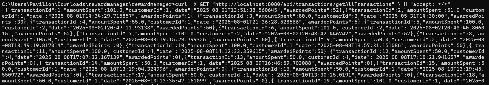
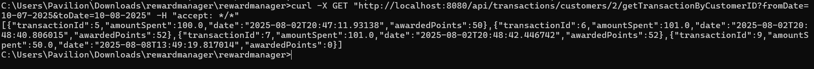
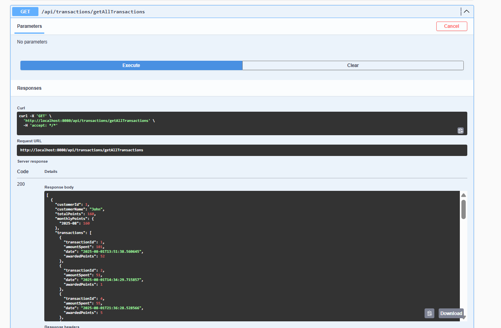
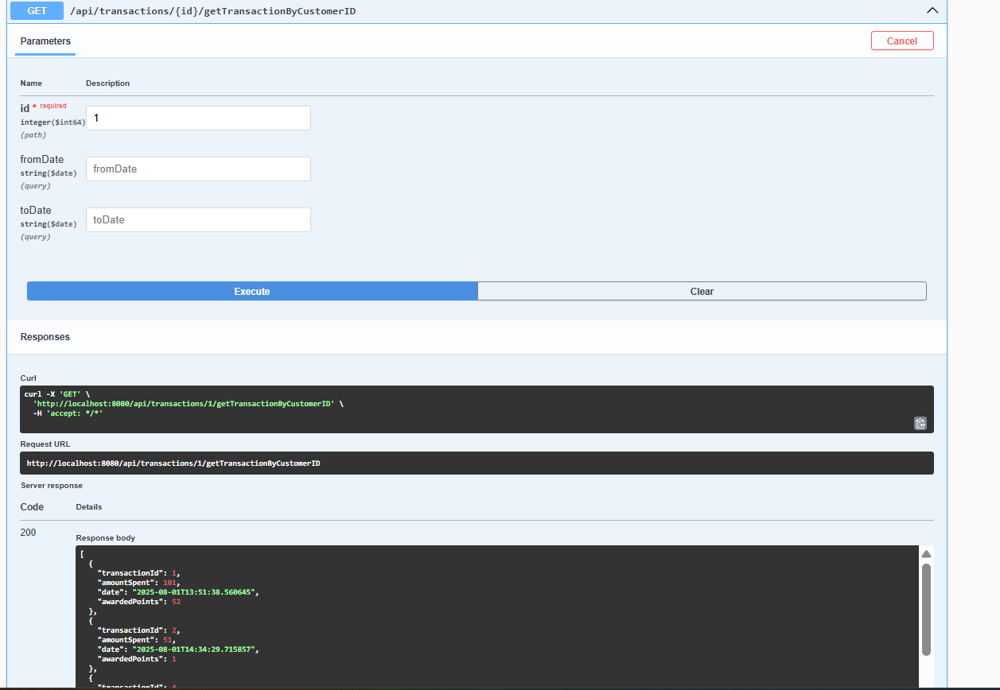
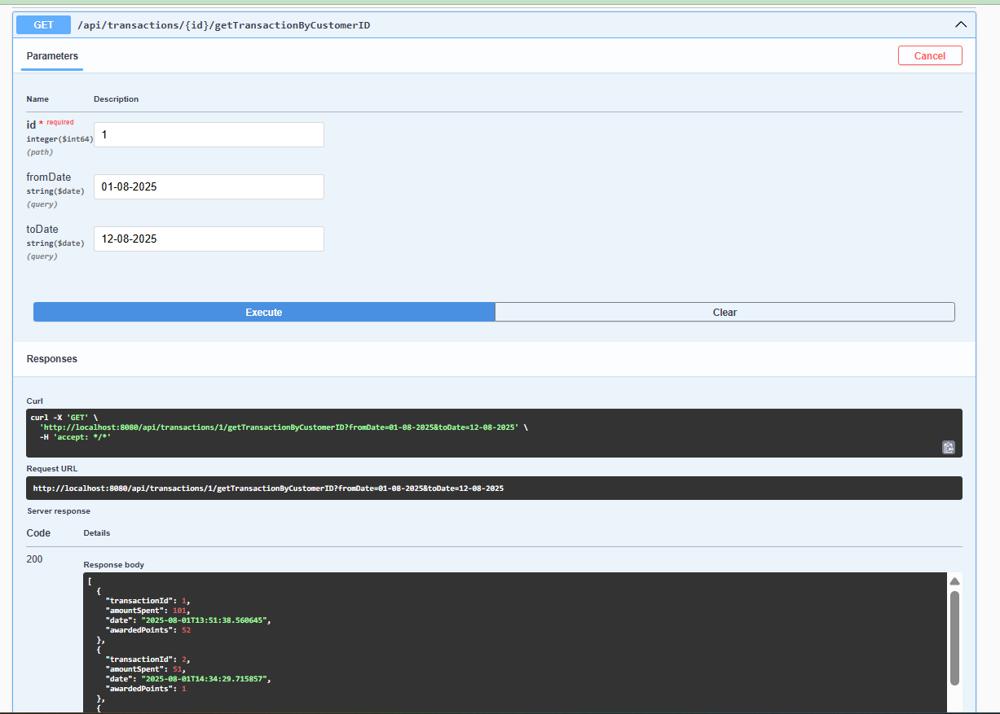

# **🏆 REWARD SYSTEM - SPRING BOOT APPLICATION**

A Spring Boot-based reward management system that allows customers to earn reward points through transactions.  
It includes REST APIs for managing customers, transactions, and calculating reward points.

---

## ✨ **Features**

- **👤 Customer Management**
  - ➕ Fetch customer details
  - 📊 View reward points for a customer

- **💳 Transaction Management**
  - 📜 Fetch all transactions
  - ⏳ Get transactions within a date range
  - 🔍 Retrieve transactions by customer ID

- **🎯 Reward Points**
  - 🔢 Calculate reward points for a customer based on transaction amount
 
   **Reward Point Logic**
  
    $50–$100 → 1 point per $1 over 50
  
    Over $100 → 2 points per $1 over 100 + 50 points (for first $50–$100)
  
    Example: Spend $120 → (20 × 2) + (50 × 1) = 90 points

## ⚙️ **Tech Stack**

- **☕ Java 17+
- **🚀 Spring Boot 3.x
- **🗄 Spring Data JPA (Hibernate)
- **🌐 Spring Web (REST API)
- **🛢 PostgreSQL Database (In-memory for testing)
- **🧪 JUnit (Unit Testing)
- **📦 Maven (Build tool)

---

## 📂 **Project Structure**

├── com.rewardsystem.rewardmanager

├── controller # REST controllers ( TransactionController)

├── dto # Data Transfer Objects ( TransactionDTO, TransactionSummarDTO)

├── entity # JPA Entities (Customer, Transaction)

├── mapper # (TransactionMapper)

├── repository # Spring Data JPA Repositories (CustomerRepositoryDao, TransactionRepositoryDao)

├── serviceImpl # Service implementations (TransactionServiceImpl)

└── exception # Custom exceptions (CustomerInvalidTransactionException)

## 📡 **API Endpoints**

 ### 👤 **Customer APIs**

**GET	/api/customers/{id}**:-	Get customer by ID

 ### 💳 **Transaction APIs**

**GET	/api/transactions/getAllTransactions**:-	Get all transactions

**GET	/api/transactions/customers/{id}/getTransactionByCustomerID?fromDate=dd-MM-yyyy&toDate=dd-MM-yyyy**:-	Get transactions within date range

## 📸 Example cURL Commands & Responses

### 1. Get All Transactions

### 2. Get Transactions by Customer ID and Date

## 📸 Example Swagger Response

### 1. Get All Transactions

### 2. Get Transactions by Customer ID 

### 3. Get Transactions by Customer ID and Date

## ⚠️ **Error Handling**

Custom Exceptions are handled as follows:

❌ CustomerNotFoundException

⚠️ InvalidTransactionException

Responses use ResponseStatusException with relevant HTTP status codes.

 📍 The application will start at:
 
     http://localhost:8080

   **Clone the repository**

   [git clone https://github.com/Ashwini2898/reward-system.git](https://github.com/Ashwini2898/Customer-Rewards.git)
