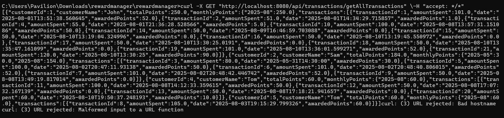

# **🏆 REWARD SYSTEM - SPRING BOOT APPLICATION**

A Spring Boot-based reward management system that allows customers to earn reward points through transactions.  
It includes REST APIs for managing customers, transactions, and calculating reward points.

---

## ✨ **Features**

- **👤 Customer Management**
  - ➕ Fetch customer details
  - 📊 View reward points for a customer

- **💳 Transaction Management**
  - ➕ Create new transactions
  - 📜 Fetch all transactions
  - ⏳ Get transactions within a date range
  - 🔍 Retrieve transactions by customer ID

- **🎯 Reward Points**
  - 🔢 Calculate reward points for a customer based on transaction amount
 
   **Reward Point Logic**
  
    $50–$100 → 1 point per $1 over 50
  
    Over $100 → 2 points per $1 over 100 + 50 points (for first $50–$100)
  
    Example: Spend $120 → (20 × 2) + (50 × 1) = 90 points

## ⚙️ **Tech Stack**

- **☕ Java 17+
- **🚀 Spring Boot 3.x
- **🗄 Spring Data JPA (Hibernate)
- **🌐 Spring Web (REST API)
- **🛢 PostgreSQL Database (In-memory for testing)
- **🧪 JUnit (Unit Testing)
- **📦 Maven (Build tool)

---

## 📂 **Project Structure**

├── com.rewardsystem.rewardmanager

├── controller # REST controllers (CustomerController, TransactionController)

├── dto # Data Transfer Objects (CustomerDTO, TransactionDTO)

├── entity # JPA Entities (Customer, Transaction)

├── mapper # (CustomerMapper, TransactionMapper)

├── repository # Spring Data JPA Repositories (CustomerRepositoryDao, TransactionRepositoryDao)

├── serviceImpl # Service implementations (CustomerServiceImpl, TransactionServiceImpl)

└── exception # Custom exceptions (CustomerNotFoundException, InvalidTransactionException)

## 📡 **API Endpoints**

 ### 👤 **Customer APIs**

**GET	/api/customers/{id}**:-	Get customer by ID

 ### 💳 **Transaction APIs**

**POST	/api/transactions/new-transaction/**:- Create a new transaction

**GET	/api/transactions/customers/{customerId}/points/**:-	Get total reward points

**GET	/api/transactions/getAllTransactions**:-	Get all transactions

**GET	/api/transactions/customers/{id}/getTransactionByCustomerID?fromDate=dd-MM-yyyy&toDate=dd-MM-yyyy**:-	Get transactions within date range

**GET	/api/transactions/customers/{id}/getAllTransactionForCustomer**:-	Get all transactions for a customer

## 📸 Example cURL Commands & Responses

### 1. Create Transaction for Amount = 50

### 2. Create Transaction for Amount = 101

### 7. Transaction for Invalid Customer ID

### 3. Get All Transactions

### 4. Get All Transactions for a Customer by ID

### 5. Get Customer by ID

### 6. Get Total Points for Customer

### 8. Get Transactions by Customer ID and Date

## ⚠️ **Error Handling**

Custom Exceptions are handled as follows:

❌ CustomerNotFoundException

⚠️ InvalidTransactionException

Responses use ResponseStatusException with relevant HTTP status codes.

 📍 The application will start at:
 
     http://localhost:8080

   **Clone the repository**

   [git clone https://github.com/Ashwini2898/reward-system.git](https://github.com/Ashwini2898/Customer-Rewards.git)
